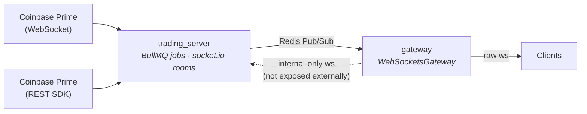

This doc records the deliberate split between WebSocket libraries and the
responsibility of each piece of the event plane (Redis Pub/Sub + WS).

## WebSocket library boundary

| App              | Library                          | Why                                                                                                                                                            |
| ---------------- | -------------------------------- | -------------------------------------------------------------------------------------------------------------------------------------------------------------- |
| `apps/gateway`   | raw `ws` (`@nestjs/platform-ws`) | The handshake is HMAC-authenticated at the HTTP-upgrade layer (`HmacAuthGuard`). Raw `ws` keeps that flow simple — no namespace/room machinery in the way.     |
| `apps/trading_server` | `socket.io`                  | Uses namespaces and rooms (`order`, `system_wallets`, `orderbook-${pair}`) for fan-out. Only reachable from the docker-internal network — gateway proxies it.  |

Both libraries are intentional. Neither is dead weight.

## Event flow (one-way)

Redis Pub/Sub is the only cross-app event channel. All gateway → trading_server
traffic is HTTP through the gateway proxy; trading_server → gateway is via Redis
channels.

Kafka + Zookeeper were removed in favor of Redis Pub/Sub. Redis was already a
hard dependency for BullMQ and the order-book hot store, so this drops two
daemons from the stack at the cost of weaker durability (Redis Pub/Sub does not
persist; an offline subscriber misses events). For events that must survive
consumer downtime, use a Postgres outbox pattern rather than publishing directly
through `EventBusPublisher`.

## Channels

Defined once in `libs/shared/src/constants/events.constants.ts`:

- `ORDERBOOK_UPDATE_CHANNEL` — order-book update for a given product (product id travels in payload `key`)
- `ORDER_UPDATE_CHANNEL` — order state changed, payload = order id
- `SYSTEM_WALLET_UPDATE_CHANNEL` — wallet/balance changed, payload = wallet id
- `NEW_DEPOSIT_CHANNEL` — new deposit detected, payload = deposit symbol

Every channel has a corresponding `<channel>.dlq` that the `EventBusPublisher`
writes to when the primary publish fails.

## Producer/consumer rules

- **One** event-bus publisher class: `EventBusPublisher` in `libs/shared/src/events/event-bus.publisher.ts`. No `catch {}` blocks; failures log structured fields and attempt a DLQ fallback.
- Consumers wrap every gateway broadcast in `safeBroadcast` so a downstream WS error never crashes the consumer.
- Coinbase WS connections (Coinbase Advanced ticker, Coinbase Prime L2 + orders) live behind `ResilientWsClient`. The class owns reconnect, listener cleanup, and shutdown — see `apps/trading_server/src/workers/order-book/resilient-ws.client.ts`.

## Shutdown ordering (target)

When `app.enableShutdownHooks()` fires:

1. Stop accepting new HTTP/WS clients.
2. Disconnect the Redis Pub/Sub microservice (consumers stop).
3. Close all `ResilientWsClient` instances (cancels reconnect timers, terminates sockets).
4. Drain BullMQ queues and close workers.
5. Disconnect Redis client(s).
6. Stop HTTP server.

## What changed in the Kafka→Redis migration

- Removed `kafka` and `zookeeper` services from `docker/docker-compose.yml`.
- Removed `kafkajs` and all `KAFKA_*` env vars.
- Renamed `kafka/` folders → `events/` across apps and the shared lib.
- `KafkaProducerService` / `KafkaSafeProducer` → `EventBusPublisher`. Uses generic `ClientProxy`, transport-agnostic.
- `KafkaModule` → `EventsModule`, `KafkaConsumerController` → `EventsConsumerController`.
- Topic constants renamed `_TOPIC` → `_CHANNEL` to match Redis terminology.
- Product key (was Kafka message key) now travels on the payload's `key` field.
- DI token renamed `KAFKA_CLIENT_NAME` → `EVENT_BUS_CLIENT`.
